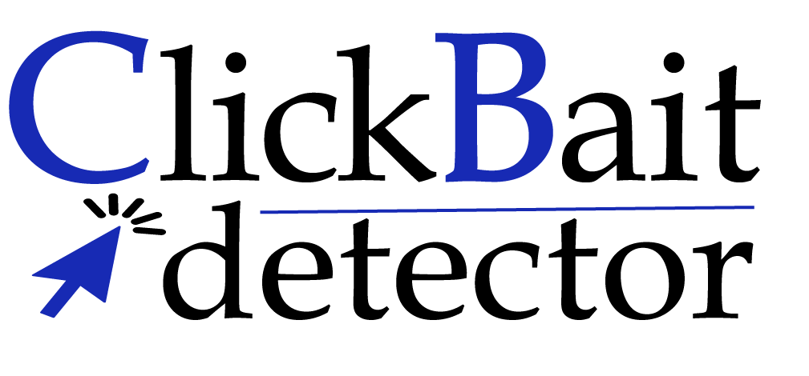

# Кликебйт Детектор Clickbait Detector
### Классификатор заголовков / classifier of titles 

# :blue_book: Содержание
+ О проекте
+ Скоро...
+ Поддержать проект
+ Проект на kaggle

# :newspaper: О проекте
Кликбейт детектор (Clickbait Detector) - расширение для браузера Google Chrome, подсвечивающий кликбейт заголовки прямо на веб-странице! Основной целью проекта является борьба с распространением кликбейта на интернет-площадках и защита пользователя от него.

*__Кликбейт (clickbait)__ - тип онлайн-контента, в котором используются сенсационные или вводящие в заблуждение заголовки, изображения или описания для привлечения кликов и генерации трафика.

# :soon: Скоро...
- [X] Плагин
- [X] Распознавание кликбейта по тексту и обложке статьи 
  
# :blue_heart: Поддержать проект
Поставьте лайк, нам будет приятно:)

# :small_blue_diamond: Проект на kaggle
[Новостные заголовки/News titles RU](https://www.kaggle.com/datasets/anzerone/clickbait-titles-ru)

